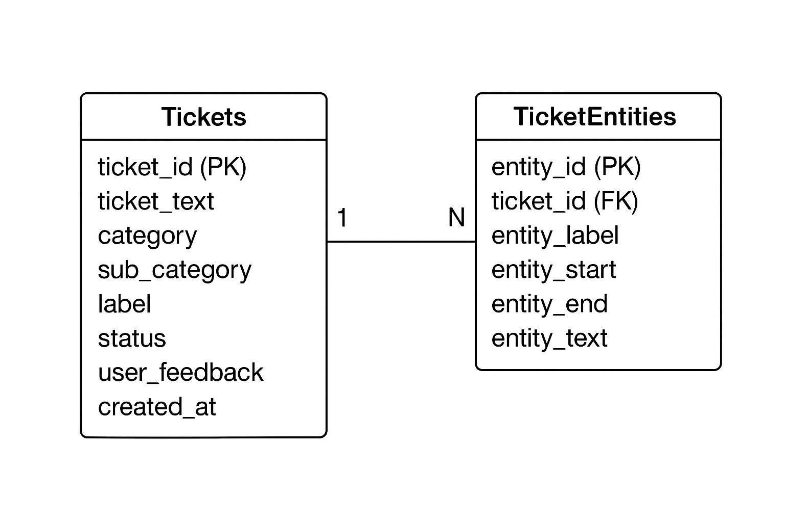

# 📁 Base de Datos — Estructura y Documentación

Este módulo contiene la definición de la base de datos utilizada en el proyecto.  
El diseño está orientado a soportar:

- Gestión de tickets
- Análisis de texto y categorías
- Almacenamiento de entidades extraídas por el modelo de IA
- Flexibilidad para futuras ampliaciones (nuevas tablas o features)

---

## 📌 Estructura General

La base de datos se compone de **dos tablas principales**:

### 1. `Tickets`
Registra la información base de cada ticket recibido.

| Campo          | Tipo            | Descripción |
|----------------|-----------------|-------------|
| `ticket_id`    | INT (PK)        | Identificador único del ticket |
| `ticket_text`  | NVARCHAR(MAX)   | Texto original del ticket |
| `category`     | VARCHAR(100)    | Categoría asignada |
| `sub_category` | VARCHAR(100)    | Subcategoría asignada |
| `label`        | VARCHAR(200)    | Etiqueta o clasificación adicional |
| `status`       | VARCHAR(50)     | Estado del ticket (pending/resolved/escalated) |
| `user_feedback`| INT             | Feedback del usuario (1–5 o 0–1) |
| `created_at`   | DATETIME        | Fecha de creación |

---

### 2. `TicketEntities`
Contiene las entidades extraídas desde el texto del ticket.  
Cada entidad corresponde a un segmento relevante detectado por IA.

| Campo          | Tipo            | Descripción |
|----------------|-----------------|-------------|
| `entity_id`    | INT (PK, IDENTITY) | Identificador único de la entidad |
| `ticket_id`    | INT (FK)        | Referencia al ticket origen |
| `entity_label` | VARCHAR(100)    | Tipo de entidad (ej: PERSON, LOCATION, PRODUCT) |
| `entity_start` | INT             | Posición inicial en el texto |
| `entity_end`   | INT             | Posición final |
| `entity_text`  | NVARCHAR(MAX)   | Texto exacto de la entidad |

---

## 🔗 Relación entre tablas

- **1 Ticket → N Entidades**
- Las entidades se eliminan automáticamente si se borra su ticket  
  (gracias al `ON DELETE CASCADE` del foreign key).

---

## 📘 Diagrama Entidad–Relación (ERD)

### ERD en ASCII (incluido en este archivo)

```
+---------------------+             +-----------------------+
|       Tickets       | 1         N |    TicketEntities     |
+---------------------+-------------+-----------------------+
| ticket_id (PK)      |             | entity_id (PK)        |
| ticket_text         |             | ticket_id (FK)        |
| category            |             | entity_label          |
| sub_category        |             | entity_start          |
| label               |             | entity_end            |
| status              |             | entity_text           |
| user_feedback       |             +-----------------------+
| created_at          |
+---------------------+
```

### Diagrama E-R





---

## 📦 Próximas extensiones posibles

El diseño permite agregar con facilidad nuevas tablas, por ejemplo:

- `Users` (si queremos registrar datos del usuario que crea un ticket)
- `Predictions` (salidas ML adicionales)
- `SentimentAnalysis`
- `TicketHistory` (trazabilidad de cambios)

---
